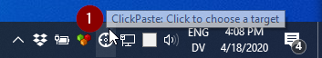
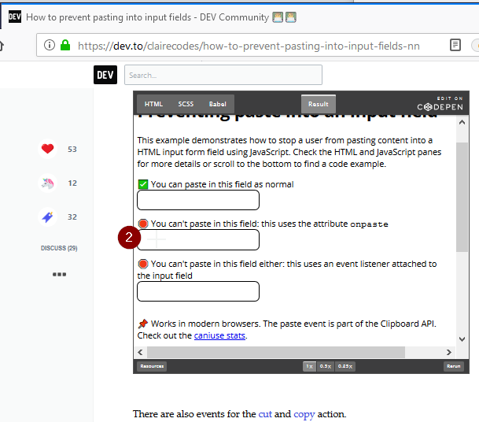

# ClickPaste
Windows 10 notification area app in C# that can paste clipboard contents as keystrokes to whatever location you click.

First of course, you need to have some text in your clipboard.  Then:

1. Click to choose a target:

 

2. Click to choose a location to paste:

 
    
3. Your clipboard is typed as keystrokes onto the window you selected:

 