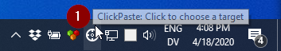
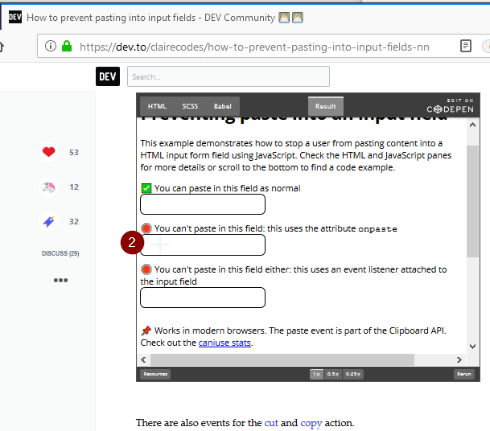
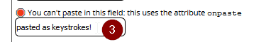
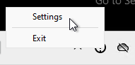
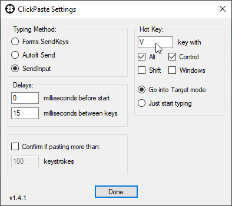
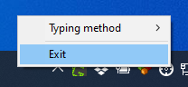

# ClickPaste
Windows 10/11 notification area app in C# that can paste clipboard contents as keystrokes to whatever location you click.

## Starting

* You can install ClickPaste using the MSI installer or get the portable ZIP from the [Releases page](../../releases/latest)
* Note that in order to paste to UAC-elevated processes, Microsoft requires the ClickPaste binary to be run from the system drive's "Program Files" folder. 
(The easiest way to achieve that is to use the MSI installer.)
* Launch ClickPaste from a shortcut or by double-clicking ClickPaste.exe.

## Usage

First of course, you need to have some text in your clipboard.  Then:

1. Click the target notification icon to begin:

 

2. Click to choose a location you want to paste the text:

 
    
3. Your clipboard contents should be typed as keystrokes onto the window you selected:

 

## Settings

Right-click the notification icon and select Settings.

* You can change between key typing modes,
  including a layout-independent Unicode mode for mixed-language text over RDP,
* Set how much delay there is before and between keystrokes, 
* Trigger a confirmation when the clipboard contains more than a chosen number of characters,
* Configure what "hot key" combination will be used (Clear the key textbox with delete or backspace if you wish to have *no* hotkey),
* Configure whether the "hot key" will activate the target selector to pick a paste location or just start typing immediately. 

## Stopping

* Right-click the notification icon and select Exit.

 
 
## Download 

* [Go to Releases page](../../releases/latest)
