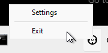

# ClickPaste
Windows 10 notification area app in C# that can paste clipboard contents as keystrokes to whatever location you click.
Forked from Collective-Software to be easier to use with remote applications.

## Starting

* Launch ClickToPaste.exe, or put it in your Startup folder.
* If you intend to paste onto windows of UAC-elevated processes, you need ClickPaste.exe to be running UAC-elevated as well.  You can do this by making a shortcut and setting its properties to "Run as Administrator"

 

## Usage

First of course, you need to have some text in your clipboard.  Then: 

0. Choose where you would like to send the keystrokes and press the pause key.

1. Click the target notification icon to begin:

 

2. Right Click to choose a location you want to paste the text:

 
    
3. Your clipboard contents should be typed as keystrokes onto the window you selected:

 
 
## Stopping

* Right-click the notification icon and select Exit.

 
 
## Download 

* [Go to Releases page](../../releases/latest)
