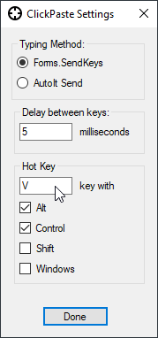

# ClickPaste
Windows 10/11 notification area app in C# that can paste clipboard contents as keystrokes to whatever location you click.

## Starting

* Launch ClickPaste.exe, or put it in your Startup folder.
* If you intend to paste onto windows of UAC-elevated processes, you need ClickPaste.exe to be running UAC-elevated as well.  You can do this by making a shortcut and setting its properties to "Run as Administrator"

 

## Usage

First of course, you need to have some text in your clipboard.  Then:

1. Click the target notification icon to begin:

 

2. Click to choose a location you want to paste the text:

 
    
3. Your clipboard contents should be typed as keystrokes onto the window you selected:

 

## Settings

Right-click the notification icon and select Settings.

* You can change between key typing modes, 
* Set how much delay there is between keystrokes, 
* Configure what "hot key" combination will invoke the target selector to pick a paste location. Clear the key textbox with delete or backspace if you wish to have *no* hotkey.

## Stopping

* Right-click the notification icon and select Exit.

 
 
## Download 

* [Go to Releases page](../../releases/latest)